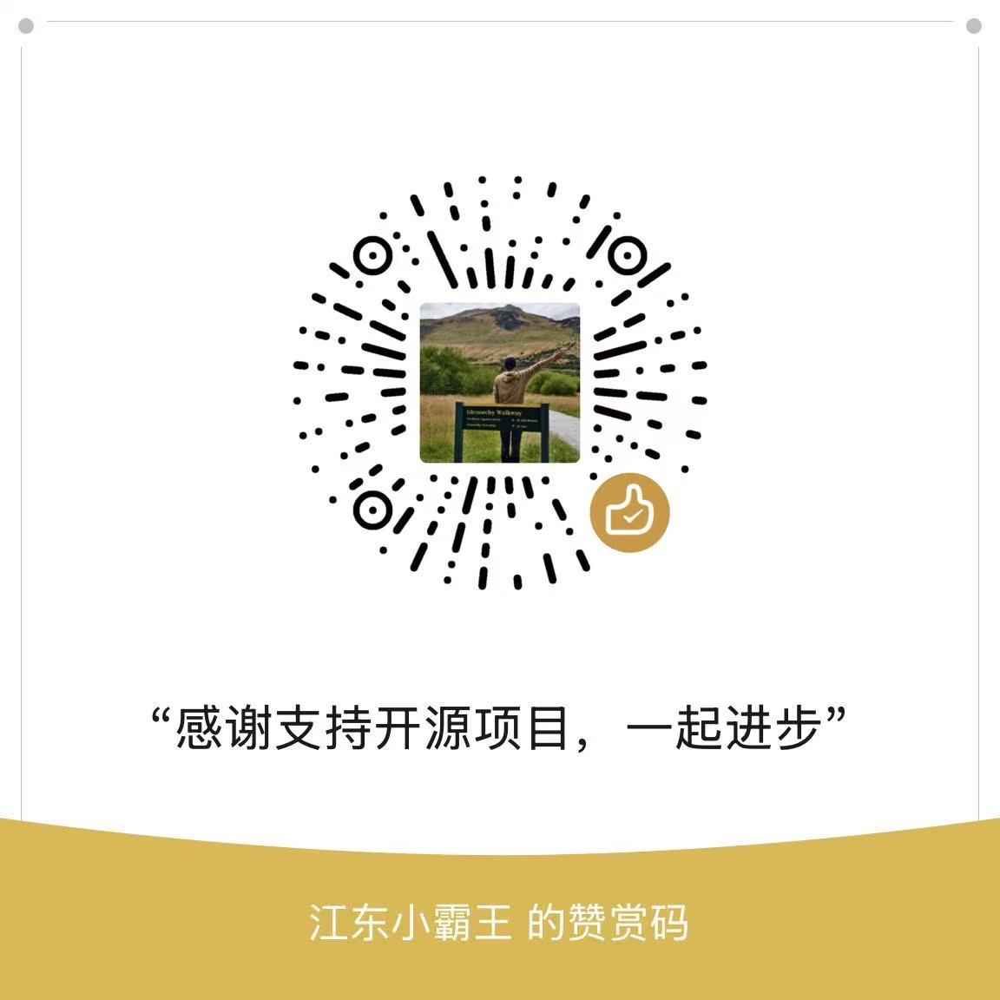

# ☕ 赞赏支持

如果这个 Skill 帮你：

- 少追一次高估值泡沫；
- 少忽略一次现金流风险；
- 更清楚地看懂一家公司当前市值隐含的未来预期；
- 搭建起自己的 AI 投研工作流；

欢迎请我喝杯咖啡。

你的支持会用于：

- 持续维护分析模板；
- 补充行业关键因子；
- 增加更多 A 股案例；
- 后续开发 AkShare 半自动取数脚本；
- 改进面向 Codex、Claude Code、OpenAI Agents 的安装体验。

---

## 微信赞赏

<!-- 请将你的微信收款码图片放到此目录，并修改下方路径 -->

## 支付宝赞赏

<!-- 请将你的支付宝收款码图片放到此目录，并修改下方路径 -->

---

## GitHub Sponsors

如果 GitHub Sponsors 可用，可以点击仓库右上角的 `Sponsor` 按钮支持维护。

---

> 每一份支持都是对开源精神的肯定，感谢！🙏
